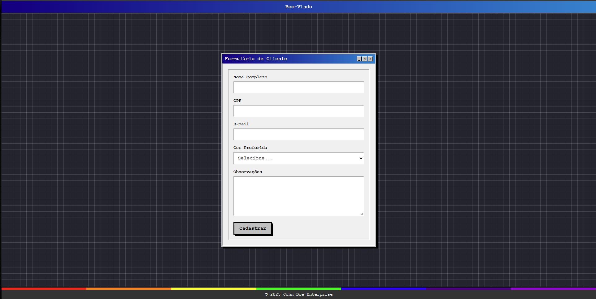

#  Sistema de Cadastro de Clientes - John Doe 

## 📋 Descrição do Projeto

Este projeto é um sistema de cadastro de clientes desenvolvido para John Doe. O sistema permite coletar e armazenar informações dos clientes como nome completo, CPF, e-mail, cor preferida e observações em um banco de dados PostgreSQL.

---

## 🛠️ Tecnologias Utilizadas

### Backend
- ☕ Java 17
- 🍃 Spring Boot 3.4.3
- 🗃️ PostgreSQL (banco de dados)
- 🐳 Docker (para implantação)

### Frontend
- ⚛️ React com Vite
- 📝 React Hook Form
- 🔍 Zod (validação de formulários)
- 🔄 Axios (requisições HTTP)
- 🎨 React Toastify (notificações elegantes)

---

## 🚀 Status do Projeto

⭐️ **Finalizado** ⭐️



---
## 📁 Estrutura do Projeto

```
📦 client-registration/
 ┣ 📂 backend/                      # Projeto Spring Boot
 ┃ ┣ 📂 src/main/java/com/johndoe/clientregistration/
 ┃ ┃ ┣ 📂 config/                  
 ┃ ┃ ┣ 📂 controller/              
 ┃ ┃ ┣ 📂 dto/                    
 ┃ ┃ ┣ 📂 exception/              
 ┃ ┃ ┣ 📂 model/                  
 ┃ ┃ ┣ 📂 repository/              
 ┃ ┃ ┣ 📂 service/                
 ┃ ┃ ┗ 📂 util/                    
 ┃ ┗ 📂 src/main/resources/
 ┃   ┗ 📜 application.properties
 ┗ 📂 frontend/                     # Projeto React (Vite)
   ┣ 📂 public/
   ┗ 📂 src/
     ┣ 📂 api/
     ┣ 📂 components/
     ┣ 📂 types/
     ┣ 📂 utils/
     ┣ 📜 App.tsx
     ┗ 📜 main.tsx
```
---
## 📝 Requisitos do Projeto

- [x] Formulário para cadastro de clientes com os campos:
  - Nome completo
  - CPF
  - E-mail
  - Cor preferida (cores do arco-íris)
  - Observações
- [x] Armazenamento em banco de dados PostgreSQL
- [x] Validação dos dados no frontend e backend
- [x] Feedback de sucesso após o cadastro
- [x] Preparação para implantação com Docker

---

## 🐳 Como Executar com Docker

### 📌 **Pré-requisitos**
Antes de executar o projeto, certifique-se de ter instalado:
- [Docker](https://www.docker.com/get-started)
- [Docker Compose](https://docs.docker.com/compose/install/)

### 🚀 **Passos para rodar o sistema**

1. **Clone o repositório** (se ainda não fez):
   ```sh
   git clone https://github.com/seu-usuario/client-registration.git
   cd client-registration
   ```

2. **Construa e inicie os containers**:
   ```sh
   docker-compose up --build -d
   ```
   - O parâmetro `--build` garante que as imagens sejam reconstruídas.
   - O `-d` executa os containers em modo **detached** (segundo plano).

3. **Verifique se os containers estão rodando**:
   ```sh
   docker ps
   ```
   Você deve ver `springboot-app`, `react-app` e `postgres-db` em execução.

4. **Acesse a aplicação**:
   - **Frontend (React):** [`http://localhost`](http://localhost)  
   - **Backend (Spring Boot):** [`http://localhost:8080`](http://localhost:8080)  
   - **Banco de Dados PostgreSQL:** `localhost:5432` (Usuário: `postgres`, Senha: `123`)

### 🛑 **Parar os containers**
Para parar a aplicação sem remover os dados:
   ```sh
   docker-compose down
   ```

Se quiser remover os containers e volumes (⚠️ isto apagará os dados do banco):
   ```sh
   docker-compose down -v
   ```

Isso garante que qualquer pessoa possa rodar seu sistema rapidamente! 🚀

---

Aqui está a seção explicando como testar a API no **Postman** ou usando **cURL**:  

---

## 📡 Testando a API com Postman/Insomnia

Após iniciar os containers com Docker, você pode testar a API usando o **Postman** ou qualquer ferramenta de requisições HTTP.

### 📝 **1. Cadastrar um novo cliente**
- **Método:** `POST`
- **URL:** `http://localhost:8080/api/clients`
- **Headers:**
  - `Content-Type: application/json`
- **Body (JSON):**
  ```json
  {
    "name": "Jonas Jonas",
    "cpf": "12345678111",
    "email": "JoJo@example.com",
    "favoriteColor": "azul",
    "observations": "Gosta das quartas-feiras"
  }
  ```
- **Resposta esperada (201 Created):**
  ```json
  {
    "success": true,
    "message": "Cliente cadastrado com sucesso!",
    "data": {
      "id": 1,
      "name": "Jonas Jonas",
      "cpf": "12345678111",
      "email": "JoJo@example.com",
      "favoriteColor": "azul",
      "observations": "Gosta das quartas-feiras"
    }
  }
  ```

### 📋 **2. Listar todos os clientes cadastrados**
- **Método:** `GET`
- **URL:** `http://localhost:8080/api/clients/getallclients`
- **Headers:** Nenhum necessário
- **Resposta esperada (200 OK):**
  ```json
  [
    {
      "id": 1,
      "name": "Jonas Jonas",
      "cpf": "12345678111",
      "email": "JoJo@example.com",
      "favoriteColor": "azul",
      "observations": "Gosta das quartas-feiras"
    }
  ]
  ```

---

### 🖥️ **Alternativa: Testar com cURL**
Se preferir testar via terminal, use:

1️⃣ **Criar um cliente**
```sh
curl -X POST http://localhost:8080/api/clients \
     -H "Content-Type: application/json" \
     -d '{
           "name": "Jonas Jonas",
           "cpf": "12345678111",
           "email": "JoJo@example.com",
           "favoriteColor": "azul",
           "observations": "Gosta das quartas-feiras"
         }'
```

2️⃣ **Buscar todos os clientes**
```sh
curl -X GET http://localhost:8080/api/clients/getallclients
```


---

## 👨‍💻 Autor

Desenvolvido por Pedro Lucas Ferreira.

---

⭐️ 